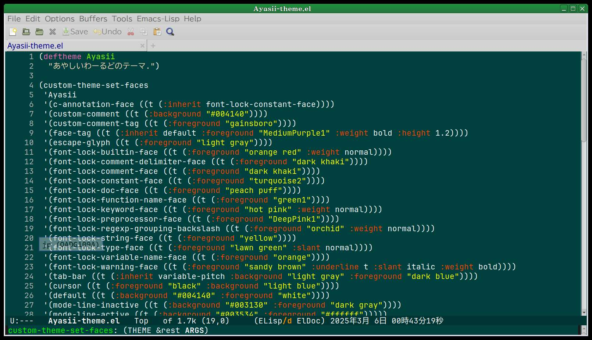
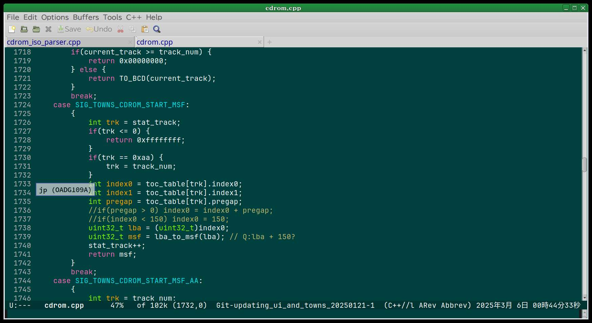
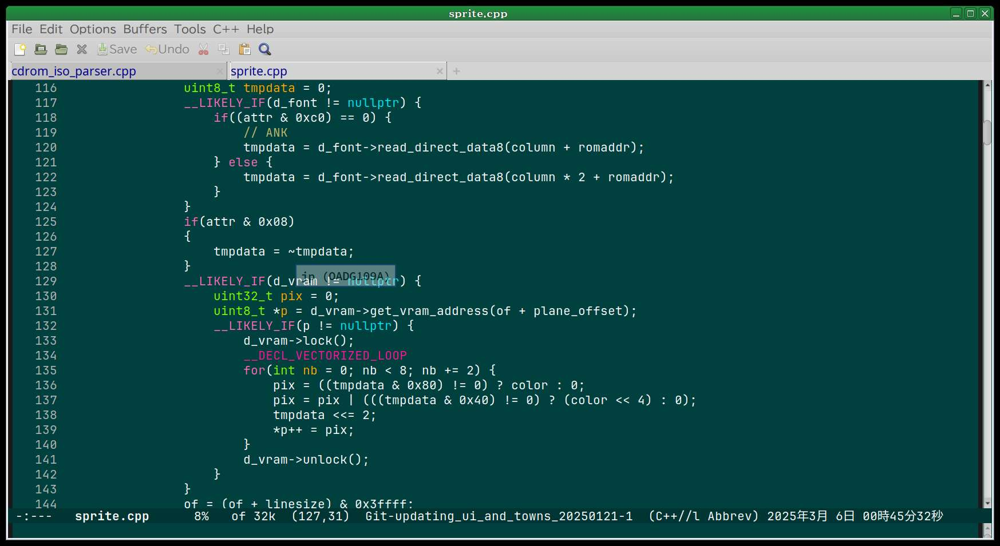
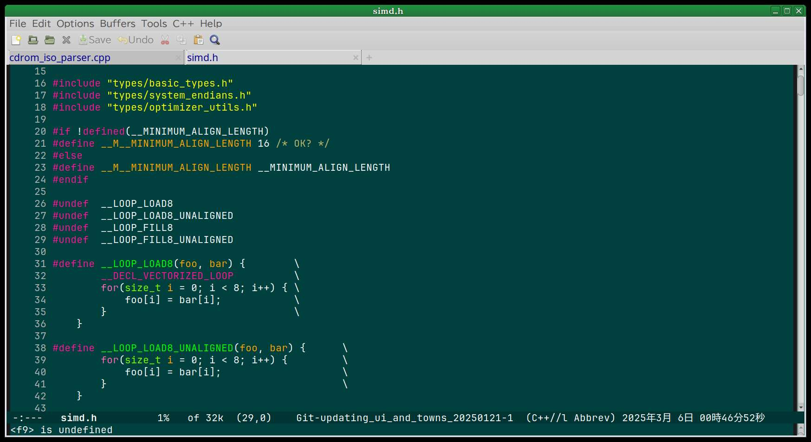
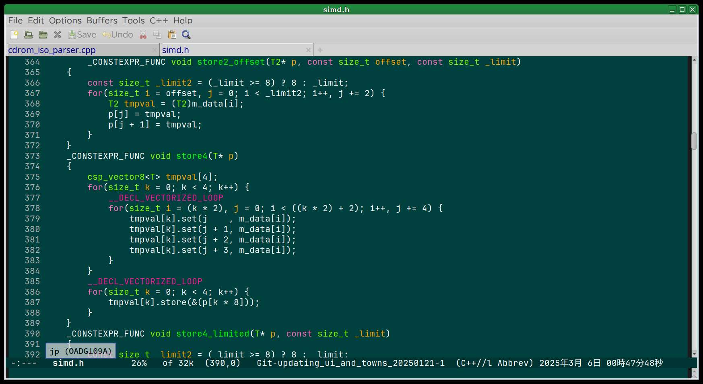
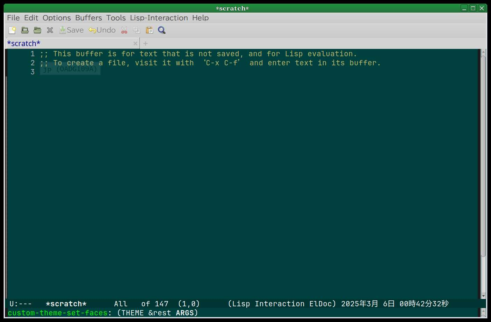

# Color theme for Emacs like a "Ayasii World" (あやしいわーるど)

<B> Feb 26, 2025
 
[ Kyuma Ohta (whatisthis.sowhat _at_ gmail.com) ](mailto:whatisthis.sowhat@gmail.com) 

</B>

## *If you can read Japanese, [japanese writing is here](/README.md/).*

About
=====

 This theme is color set inspired by nostalgic , pioneer of Japanese
WEB forum, "あやしいわーるど" (Ayasii wa-rudo / Ayasii World).

 I tried to reduce eyestrain for programming and writing.

Sceenshots
=====

Source Code
=====

[ https://github.com/Artanejp/Ayasii-emacs-theme/ ](https://github.com/Artanejp/Ayasii-emacs-theme/)

Usage
=====

 Place Ayasii.el to ~/.emacs.d/ and set default theme from Emacs.
 (Still loose writing.)
