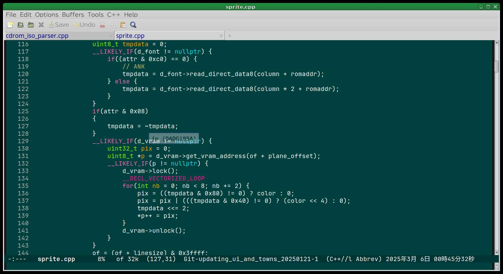

# あやしいわーるど風のEmacsカラーテーマ

<B>Feb 26, 2025
 
[Kyuma Ohta ( whatisthis.sowhat _at_ gmail.com ) ](mailto:whatisthis.sowhat@gmail.com)
</B>

## *If you can't read Japanese, [english writing is here](/README.en.md/).*

概要
======

 今は懐かしくなった？日本のWEB掲示板グループの先駆けの一つである「あやしいわーるど」系統で良く使われていた、緑の「黒板色」をベースに、
GNU Emacs のテーマにしてみました。

 プログラミングとか物書きとかで、目が疲労しにくいような配色を心がけてみました。

スクリーンショットなど
=====

ソースコード
=====

[https://github.com/Artanejp/Ayasii-emacs-theme/](https://github.com/Artanejp/Ayasii-emacs-theme/)

使い方
=====

Ayasii.el を~/.emacs.d/辺りに入れておいて、Emacsからデフォルトテーマに設定してみてください（未だいい加減なことしか書かない…）

